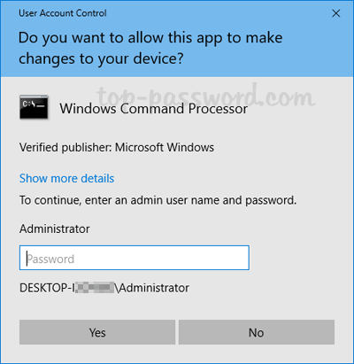

# Running the Macro

**Before you start the macro, make sure you have done the following things:**

* Make sure Roblox is in full-screen when running the macro
* Make sure to disconnect any external monitors. They _may_ not work with the macro (only applies to laptops/MacBooks)
* Make sure Roblox is on your main monitor (It is the one with the "1" when in display settings on Windows)
* Claim a hive before starting the macro

## macOS:


**IMPORTANT:** The `run_macro.command` The file has to stay in the macro folder. Moving it outside the folder will cause the macro to break.


#### Errors when opening the macro

There are mainly two different errors:

**Error: Unidentified Developer**

>)

To fix this, right-click `run_macro.command` and press Open.

**Error: Could not verify it is free of malware**

>)



### Open anyway

Go to System Settings -> Privacy and Security -> scroll all the way down -> click "Open Anyway" for `run_macro.command`.



## Windows:

Double-click on the `run_macro.bat` file, and it should open up a new window; it will then ask for administration privileges (Needed so the macro can control your keyboard + mouse):\

> Example image from: top-password.com


That's all the steps you need for now. If you need help or have any questions, please visit the Discord server: [https://discord.gg/c4XM7XJjrP](https://discord.gg/c4XM7XJjrP)

